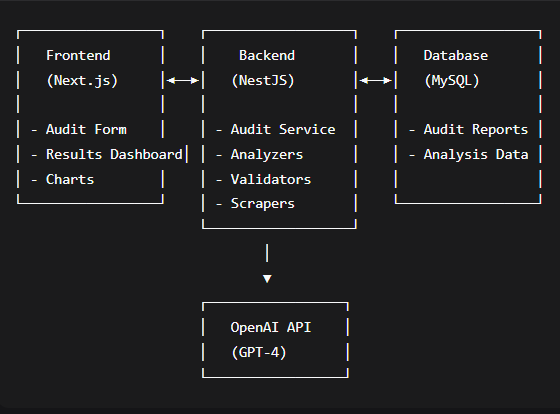

# 🚀 Content Quality Audit Tool

An AI-powered platform that analyzes and improves written content across SEO, SERP ranking, AI discoverability, human readability, and competitive differentiation—**all in one place**.

---

## 📌 A. Problem Statement

Content creators struggle to optimize content across multiple dimensions such as SEO, readability, AI discoverability, and SERP competitiveness.
Existing tools only solve individual parts of the problem, forcing creators to use multiple platforms—leading to:

* Time-consuming workflows
* Fragmented insights
* Inconsistent content quality
* Lack of competitive benchmarking

---

## 📌 B. Solution Overview

Our **AI-powered Content Quality Audit Tool** solves this problem by analyzing content across **9 critical dimensions** using the OpenAI GPT-4 engine.

### 🔍 Key Features

* **SEO Optimization Analysis**
* **SERP Performance Prediction**
* **AEO (AI Engine Optimization)**
* **Humanization Score**
* **Competitive Differentiation**
* **Readability Score**
* **Grammar Score**
* **Clarity Score**
* **Content Structure Score**

### 🌟 Expected Impact & Value

* ⏳ **Time Efficiency:** Analysis in seconds, not hours
* 🔎 **Comprehensive 360° Insights**
* 🛠 **Actionable Recommendations**
* 🆚 **Competitive Benchmarking**
* 📝 **Content Quality Boost for Ranking & Engagement**

---

## 📌 C. Architecture Diagram




---

## 📌 D. Tech Stack

### **Frontend (Next.js 14 + TypeScript)**

* Next.js 14
* Tailwind CSS
* Shadcn/UI + Radix UI
* Recharts (Graphs & Charts)
* Framer Motion (Animations)
* React Quill New (Rich Text Editor)
* Lucide Icons

### **Backend (NestJS + MySQL)**

* NestJS Framework
* TypeORM
* MySQL
* Playwright (Web Scraping)
* OpenAI GPT-4 API

### **Development & Tools**

* Git
* npm

---

## 📌 E. How to Run the Project

### **System Requirements**

* Node.js ≥ 18
* npm ≥ 9
* MySQL ≥ 8
* Git
* OpenAI API Key

---

### ▶️ **Step 1: Clone the Project**

```sh
git clone <your-repository-url>
cd content-audit-tool
```

---

### ▶️ **Step 2: Backend Setup**

#### 2.1 Navigate to backend

```sh
cd backend
```

#### 2.2 Install dependencies

```sh
npm install
```

#### 2.3 Configure environment

```sh
cp .env.example .env
```

Edit `.env` and add:

```
OPENAI_API_KEY=sk-your-openai-api-key-here
```

#### 2.4 Database Setup

Open MySQL:

```sql
CREATE DATABASE content_audit;
```

#### 2.5 Install Playwright

```sh
npx playwright install
```

#### 2.6 Start Backend Server

```sh
npm run start:dev
```

**Expected Output:**

```
[Nest] 12345 - LOG [Nest Application] Successfully started on port 5008
```

---

### ▶️ **Step 3: Frontend Setup**

#### 3.1 Navigate to frontend

```sh
cd ../frontend
```

#### 3.2 Install dependencies

```sh
npm install
```

#### 3.3 Start frontend server

```sh
npm run dev
```

**Expected Output:**

```
▲ Next.js 14.0.0
- Local: http://localhost:3000
✓ Ready in 2.1s
```

---

### ▶️ **Step 4: Access Application**

* **Frontend:** [http://localhost:3000](http://localhost:3000)
* **Backend API:** [http://localhost:5008](http://localhost:5008)

---

## 📌 F. API Keys / Usage Notes

Required Key (Backend `.env`):

```
OPENAI_API_KEY=<your-key>
```

🔐 **Important**

* Never commit API keys to GitHub
* Always use environment variables
* OpenAI usage may incur costs

---

## 📌 G. Sample Input & Output

### 📝 Sample Input

**Content:**

> Artificial Intelligence is rapidly transforming the modern world…

**Keyword:**
`AI business adoption`

---

### 📤 Sample Output

<details>
<summary>Click to expand full JSON output</summary>

```json
{
  "content": "...",
  "keyword": "AI business adoption",
  "seo": {
    "score": 65,
    "issues": [
      "Keyword density for 'AI business adoption' is low (0.0%)",
      "Missing header structure (H1, H2, H3)",
      "No meta description present",
      "Lack of internal/external links",
      "Content is not optimized for featured snippets"
    ],
    "goodat": [
      "Content is informative and relevant",
      "Clear call to action implied",
      "Addresses common challenges"
    ],
    "recommendations": [
      "Increase keyword density",
      "Add proper header tags",
      "Create a strong meta description"
    ]
  },
  "serp": {
    "score": 45,
    "issues": [
      "Lacks depth",
      "Missing statistics or data",
      "Word count lower than top-ranking pages"
    ],
    "recommendations": [
      "Increase word count to 1500+",
      "Add statistics, quotes",
      "Include case studies"
    ]
  },
  "aeo": { "score": 4, "issues": [...], "recommendations": [...] },
  "humanization": { "score": 5, "issues": [...], "recommendations": [...] },
  "differentiation": { "score": 4, "issues": [...], "recommendations": [...] },
  "readability": { "score": 55.2, "issues": [...], "recommendations": [...] },
  "grammar": { "score": 100 },
  "clarity": { "score": 7, "issues": [...], "recommendations": [...] },
  "structure": { "score": 65 },
  "overallScore": 38.91,
  "createdAt": "2025-11-25T12:07:23.152Z"
}
```

</details>

---

## 📌 H. Demo Video

👉 *Find the Link Here*
<!-- `https://drive.google.com/file/d/14HHyE4OhLaF8Ens2RKoRp-sWPmgIOB18/view` -->

## 📌 I. Future Scope I have Observed
 -> Can Generate more Attractive Reports.
 -> Multi-Language Content Auditing.
 -> Can also Scrape the Youtube Video Links to Analyse the Content.

